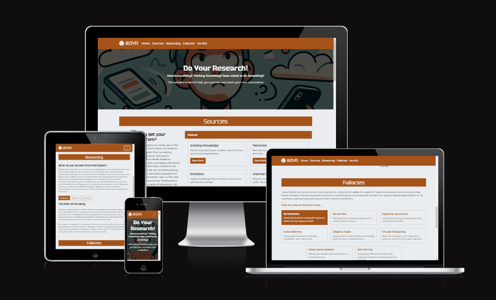
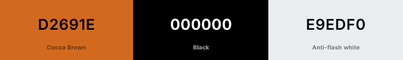
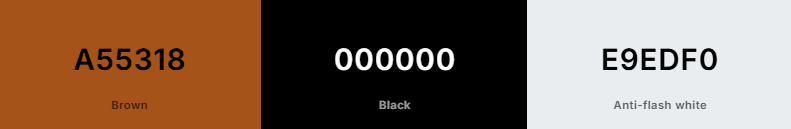
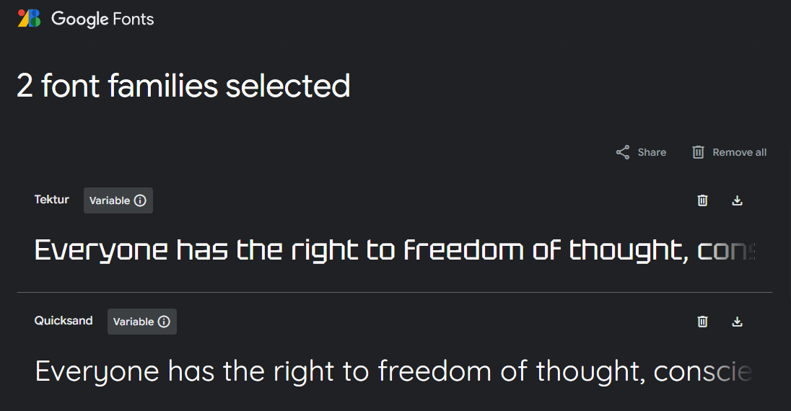
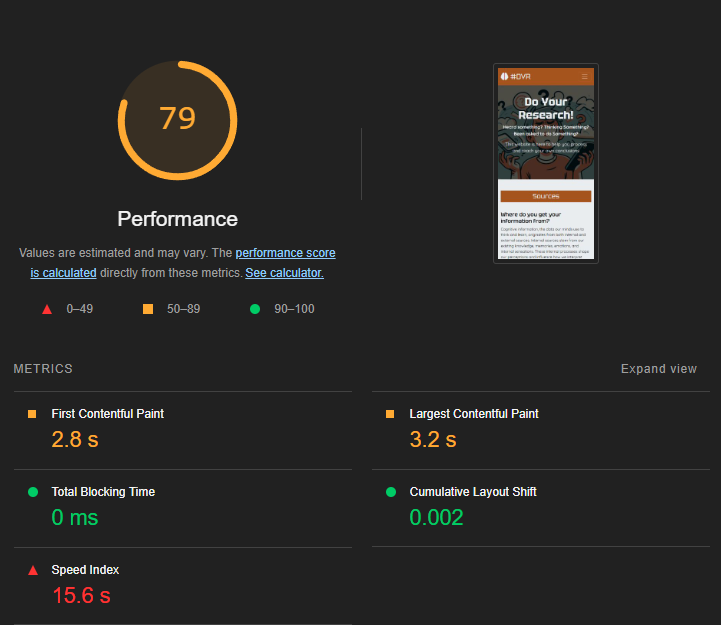
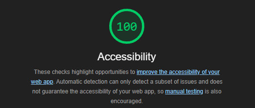
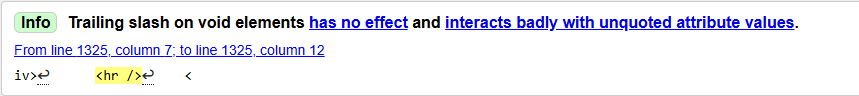

# Do Your Research! - Critical Thinking Support

Note - Any content produced by AI (and reviewed by an NI) in the documentation is prefixed by AI - after 2 prompts copilot itself was prefixing it's own answers.

## Purpose

AI -The purpose of this site is to introduce users to critical thinking and reasoning skills. A lack of awareness in these areas can lead to various safeguarding and wellbeing issues. For example, individuals who do not practice critical thinking may fall prey to misinformation or make decisions based on incomplete or biased information, which can have serious consequences for their personal and professional lives.

AI - By providing resources and information on these concepts, the site aims to empower users to think for themselves. This includes understanding logical fallacies, recognizing cognitive biases, and evaluating the credibility of sources. For instance, users will learn how to identify common fallacies such as ad hominem attacks or false dilemmas, which can help them engage in more constructive and rational discussions.

AI - Ultimately, the goal is to help users make informed decisions and better navigate complex situations. Whether it's assessing the validity of a news article, making a significant life choice, or participating in a debate, the skills taught on this site will enable users to approach problems with a critical and analytical mindset, leading to more effective and reasoned outcomes.

## User Stories

User stories were outlined on a [kanban board on GitHub](https://github.com/users/joe-aswonvos/projects/3/views/1?layout_template=board)

### Must Have

#### User Story 1 - User Friendly Navigation and Responsive Design
---

As a first-time visitor, I need easy navigation and a user friendly design, including a responsive layout for my device, so that I can find information quickly and efficiently without frustration

Acceptance Criteria

- The website is fully responsive across various devices and screen sizes.
- Site layout and navigation are intuitive, allowing easy access to different sections.

Tasks

- Utilize Bootstrap and responsive design principles to ensure the website is accessible across devices.
- Arrange the site layout and navigation based on best practices, ensuring all key sections are easily accessible.

AI - Ensure the website is easily navigable and fully responsive across various devices.

---

#### User Story 2 - Impactful First Impression
---

As a first-time user of the website, the first view of the site should engage me.

Acceptance Criteria

- The top of the site contains a hero section.
- The hero section holds an appropriate image and text.

Tasks

- Using Bootstrap, construct a responsive, screen width hero section.
- Utilising available tools, include an image and text for this section.

AI - As a first-time user of the website, the first view of the site should engage me with a hero section containing an appropriate image and text.

---

#### User Story 3 - Useful Content in a Logical Order
---

As a user of the website, reading from top to bottom should take me through a logical process to parse information, with opportunities to find out more detail.

Acceptance Criteria

- Page contains sections to aid thinking on:
    - Sources.
    - Reasoning.
    - Logical Fallacies.
    - Drawing Conclusions.
    - Options to deepen understanding.

Tasks

- Using Bootstrap, construct responsive sections to hold the information, utilising a variety of methods.
- Utilising available tools, populate these sections with relevant information.
- Ensure detail is available to users through pop-up or similar functionality.

AI - As a user, I should be able to navigate through logically ordered content sections to enhance my understanding of critical thinking concepts.

---

### Should Have

#### User Story 4 - Footer w/About Section and Social Links
---

As a user, should I wish to follow the site, I should have easily visible information to the relevant social media channels.

Acceptance Criteria

- Responsive footer applied to the page.
- Footer contains brief about section.
- Footer contains links to relevant social media channels.

Tasks

- Using Bootstrap, build the footer.
- Following best practice, add the social media links (new page, noopener, aria-label etc.).

AI - As a user, I should have access to a responsive footer with an about section and social media links.

---

### Could Have

#### User Story 5 - Contact Form
---

As a user, I should be able to contact the website to advise of errors, provide feedback etc.

Acceptance Criteria

- Functional Contact form in the footer section.
- Positive user feedback on form submission.

Tasks

- Design and implement a contact form, remaining within the same HTML document.
- Design and implement a mechanism to give the user feedback that a form has been submitted.

AI - As a user, I should be able to contact the website to provide feedback or report errors through a functional contact form.

---

#### User Story 6 - In line links to wikipedia entries
---

As a user, there may be words or themes I am un-familar with, I should be able to click on those items to a reputable source of information.

Acceptance Criteria

- Potentially unfamiliar terms in the text are linked to wikipedia topics on the subject
- User contact form includes this option as a dropdown.

Tasks

- Identify 20 terms or concepts taken as assumed knowledge in the content and link to relevant articles on Wikipedia
- Update the contact form to enable users to suggest further unfamiliar terms to be linked

AI - As a user, I should be able to click on unfamiliar terms to access reputable sources like Wikipedia for more information.

---

## Design Decisions

There are a number of constraints on the design of the project based on the learning outcomes we are required to demonstrate, these include;
- The project should be one-page, I have interpreted this literally, as being a single page HTML file.
- We should be fully utilising the benefits of the Bootstrap framework.
- The project should be HTML and CSS only
- The project should be deployed on GitHub pages
- Wherever possible we should be utilising AI to improve our efficiency.

To focus on the design element, all the page content was created via AI, effectively simulating this being provided a client or content-team.

AI - The design of the project is constrained by specific learning outcomes, including the requirement for a single-page HTML file, full utilization of the Bootstrap framework, HTML and CSS only, deployment on GitHub Pages, and leveraging AI tools for efficiency.

### Wireframes

AI - Building wireframes is crucial in the design process as it allows for the visualization of the layout and structure of a project, ensuring that all elements are strategically placed and user experience is optimized before development begins.

AI - Responsive design is crucial as it ensures that a website provides an optimal viewing experience across a wide range of devices, enhancing usability and accessibility for all users.

#### Mobile Layout

The intended mobile layout is a straightforward vertically scrolling site, with opportunities to click on items and open offcanvas elements for more information.

#### Desktop Layour

The intended desktop layout takes advantage of increased screen real-estate to put content side by side under the section headers, to prevent undue repitition of the sections, different Bootstrap elements and ordering will be used for variety.

### Colour Palette

AI - The importance of color palette and contrast in web design lies in ensuring readability, accessibility, and visual appeal, which are crucial for providing an inclusive and engaging user experience.

I had originally chosen a simple palette of orange, black and a slight off-white;

However on accessibility testing it became apparent that the contrast between the orange and the black/white was insufficient, and a slight change was needed.

This caused some issues of its own when the brown was the text colour on the black background, and a general 'flip' between the colours was required to maintain readability.

### Font

AI - Choosing the right font for a website is crucial as it impacts readability, user experience, and the overall aesthetic appeal, ensuring that the content is accessible and engaging for all users.

Google fonts were utilised, with a stylised font 'Tektur' chosed for headings and a readable sans-serif 'Quicksand' chosed for body text.

### Images

### Icons

### Favicon

### AI Tools

AI - Using AI tools can significantly enhance a developer's productivity by automating repetitive tasks, providing intelligent code suggestions, and generating relevant content quickly.

#### GitHub Copilot

Copilot was used in 2 ways:

1. AI - Code Suggestions: GitHub Copilot provided code suggestions and autocompletions to speed up the development process.
2. AI- Documentation: GitHub Copilot assisted in generating markdown documentation, ensuring consistency and saving time.

#### Google Gemini

Gemini was used to produce all the text content for the project - effectively acting as a context appropriate lorem ipsum.

AI - Using AI-generated text on an example website ensures that the content is contextually relevant and engaging, providing a more realistic and meaningful user experience compared to generic lorem ipsum.

#### MS Copilot

MS Copilot was used to generate the hero image, replacing a 'traditional' stock photo obtained from unsplash.

AI - Using an AI-generated image allows for more customization and uniqueness compared to a stock photo, ensuring the visual content is tailored specifically to the project's needs.

## GitHub

## Features Implementation

### Navigation

### Content

### Styling

### Footer/Form

## Testing and Validation

### Testing Plan

Testing plan produced and saved on the kanban board [here](https://github.com/joe-aswonvos/ci-bootstrap-individual-project/issues/8)

The majority of the testing consisted of checking the elements within the page function as intended, where there were no issues, there were also some external tools/benchmarks used;

### Lighthouse Report - Performance (Mobile)

Given the project is hosted on GitHub pages, and is reliant on both Bootstrap and FontAwesome external libraries, a number of the performance issues are outside of my control, however 2 suggestions were able to be implemented via code-edits to the HTML head;
- Preload the background image of the hero section
- Preconnect to the Font-Awesome

Final performance report

### Lighthouse Report - Accessibility (Mobile)

The initial result indicated a couple of items to work on;
- Colour contrast, for readability (see [colour section](#colour-palette))
- Correct use of descending headings across the page - these had been applied as an approximation, but some headings were skipped in the final result. As I was happy with the visuals for the headings I corrected the heading type, but added the bootstrap class of the 'incorrect' heading to keep the styling.

After making the changes, the report came back at 100%

### WC3 Validation

No material issues, 8 'info' pieces of feedback on the same issue - feel this is likely added by AI in production of boilerplate/suggestions.

This required a dip into the html to fix - I considered asking Co-Pilot to do it, but given it was likely the source of the issue I didn't want to introduce further syntax errors.

## Deployment

## Reflections

## Final Thoughts

## Attributions