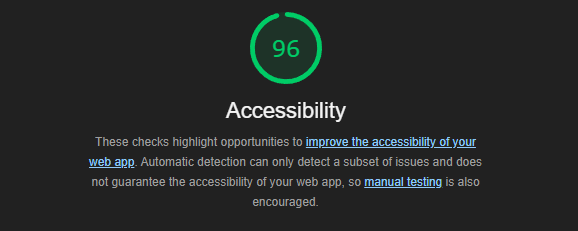

# Do Your Research! - Critical Thinking Support

Note - Any content produced by AI (and reviewed by an NI) in the documentation is prefixed by AI - after 2 prompts copilot itself was prefixing it's own answers.

## Purpose

AI -The purpose of this site is to introduce users to critical thinking and reasoning skills. A lack of awareness in these areas can lead to various safeguarding and wellbeing issues. For example, individuals who do not practice critical thinking may fall prey to misinformation or make decisions based on incomplete or biased information, which can have serious consequences for their personal and professional lives.

AI - By providing resources and information on these concepts, the site aims to empower users to think for themselves. This includes understanding logical fallacies, recognizing cognitive biases, and evaluating the credibility of sources. For instance, users will learn how to identify common fallacies such as ad hominem attacks or false dilemmas, which can help them engage in more constructive and rational discussions.

AI - Ultimately, the goal is to help users make informed decisions and better navigate complex situations. Whether it's assessing the validity of a news article, making a significant life choice, or participating in a debate, the skills taught on this site will enable users to approach problems with a critical and analytical mindset, leading to more effective and reasoned outcomes.

## User Stories

### Must Have

### Should Have

### Could Have

## Design Decisions

### Wireframes

### Colour Palette

### Font

### Images

### Icons

### Favicon

### AI Tools

AI - Using AI tools can significantly enhance a developer's productivity by automating repetitive tasks, providing intelligent code suggestions, and generating relevant content quickly.

#### GitHub Copilot

Copilot was used in 2 ways:

1. AI - Code Suggestions: GitHub Copilot provided code suggestions and autocompletions to speed up the development process.
2. AI- Documentation: GitHub Copilot assisted in generating markdown documentation, ensuring consistency and saving time.

#### Google Gemini

Gemini was used to produce all the text content for the project - effectively acting as a context appropriate lorem ipsum.

AI - Using AI-generated text on an example website ensures that the content is contextually relevant and engaging, providing a more realistic and meaningful user experience compared to generic lorem ipsum.

#### MS Copilot

MS Copilot was used to generate the hero image, replacing a 'traditional' stock photo obtained from unsplash.

AI - Using an AI-generated image allows for more customization and uniqueness compared to a stock photo, ensuring the visual content is tailored specifically to the project's needs.

## GitHub

## Features Implementation

### Navigation

### Must Have's

### Should Have's

### Could Have's

## Testing and Validation

### Lighthouse Report

### Lighthouse Report

### WC3 Validation

## Deployment

## Reflections

## Final Thoughts

## Attributions